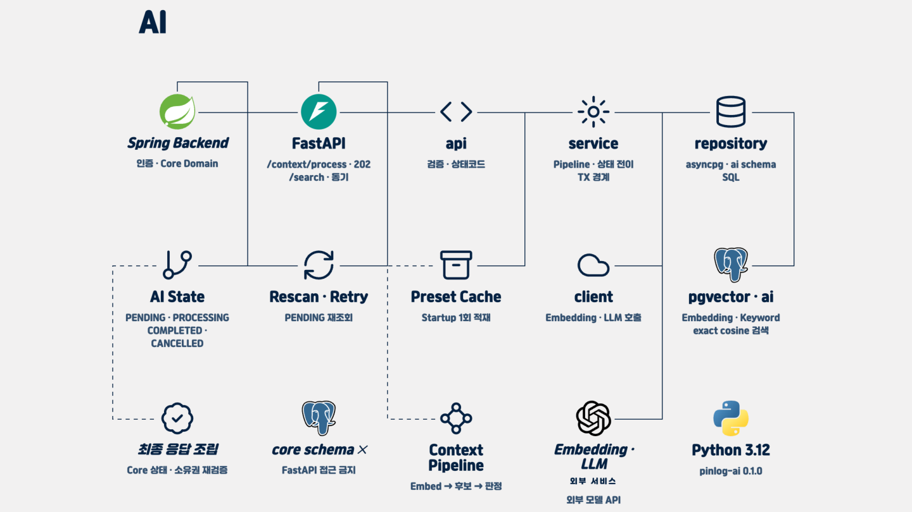

# PinLog AI

PinLog의 내부용 FastAPI AI 서버입니다. Context 임베딩과 Keyword 판정 결과를 만들고,
사용자별 자연어 검색과 이미지 기반 장소 제안을 제공합니다. Client는 이 서버를 직접 호출하지
않으며, Spring Backend가 내부 네트워크의 `/internal/v1/*` API를 호출합니다.

## 시스템 아키텍처



FastAPI는 AI 계산과 `ai` 스키마의 파생 데이터만 소유합니다. User 인증, 소유권 판단,
Core 도메인 상태 변경, Feed 계산, 최종 응답 조립은 Spring Backend의 책임입니다.

### 런타임 경계

- **Internal-only API**: `/internal/v1/*`는 서비스 간 공유 시크릿을 검증하며 외부 Client에
  노출하지 않습니다. `/health`와 `/ready`만 Kubernetes probe를 위해 인증 경계 밖에 둡니다.
- **단방향 의존**: `api → service → {repository, cache, client}`만 허용합니다. Router는 요청
  검증과 HTTP 계약, service는 오케스트레이션과 트랜잭션 경계, repository는 `ai` SQL,
  cache는 Preset 스냅샷, client는 외부 AI·검색 API 호출을 담당합니다.
- **DB 경계**: 애플리케이션 DB role은 `ai` 스키마만 접근합니다. 연결의 `search_path`는
  `ai, public`이며 `public`은 pgvector 타입 등록에만 필요합니다. `core`는 경로와 권한에서
  제외하고 조회도 하지 않습니다.
- **Migration 소유권**: DDL과 Flyway migration은 Backend가 소유합니다. Backend Flyway가
  `ai` 스키마를 먼저 준비해야 서버와 Preset bootstrap을 실행할 수 있으며, AI 앱은 시작 시
  migration이나 DDL을 실행하지 않습니다.

상세 계약은 [`docs/spec/architecture.md`](docs/spec/architecture.md)를 따릅니다.

## 핵심 처리 흐름

### Context 처리: 비동기 접수

`POST /internal/v1/context/process`는 요청을 BackgroundTasks에 등록하고 **202 Accepted**를 즉시
반환합니다. 202는 완료가 아니라 접수 성공을 뜻하며, 완료 webhook이나 polling API는 없습니다.
Backend는 `ai.context_ai_state`를 조회해 진행 상태를 확인합니다.

```text
State 사전 검사
→ Embedding 생성 또는 완료 결과 재사용
→ Preset cosine Top-K 후보 선정
→ 후보 안에서만 LLM judge
→ 저장 직전 State 재검사
→ 파생 데이터 저장과 COMPLETED 전이
```

Embedding과 Keyword는 독립 상태이므로 Embedding이 이미 완료된 요청은 Keyword 단계부터 부분
재개할 수 있습니다. Preset 후보가 없으면 LLM을 호출하지 않고 Keyword 0건으로 정상 완료합니다.
자세한 순서와 상태 계약은
[`context-processing.md`](docs/spec/context-processing.md),
[`state-machine.md`](docs/spec/state-machine.md),
[`partial-resume.md`](docs/spec/partial-resume.md),
[`keyword-preset.md`](docs/spec/keyword-preset.md)를 참고합니다.

### 개인 검색: 동기 응답

`POST /internal/v1/search`는 요청 안에서 동기적으로 다음 흐름을 완료합니다.

```text
Embedding Profile 검사
→ 질의 전체를 한 번 Embedding
→ user_id · is_deleted · COMPLETED · Profile 필터
→ pgvector exact cosine 계산
→ Record별 최고 유사도 Context 집계와 결과 컷
→ recordId · contextId · similarity · keywordMatched 반환
```

검색은 HNSW/IVFFlat 같은 ANN 인덱스를 사용하지 않고 pgvector `<=>` 연산자의 **exact cosine**을
사용합니다. 후보를 사용자와 상태로 먼저 제한하고, Record마다 가장 유사한 Context 하나만
반환합니다. 원문과 소유권은 `core`에서 Backend가 다시 확인하며 FastAPI는 Core 본문을 읽거나
반환하지 않습니다. 검색 질의 재작성과 Keyword 재정렬은 설정으로 활성화할 수 있는 강등 가능한
보조 신호이며, 실패하면 기본 벡터 검색으로 복귀합니다. 별도의
`POST /internal/v1/search/judge`는 Backend가 보낸 후보의 LLM 관련도를 동기 판정합니다.

정확한 Query와 반환 계약은 [`docs/spec/personal-search.md`](docs/spec/personal-search.md)를
참고합니다.

### 삭제·중복·stale 작업 방어

모델 호출은 DB 트랜잭션 밖에서 수행하고, 상태 잠금은 결과 저장 직전에만 짧게 잡습니다.

1. 잠금 없는 사전 검사는 이미 취소되거나 완료된 작업의 모델 호출 비용을 막습니다.
2. 조건부 UPDATE는 `PENDING` 또는 만료된 `PROCESSING`만 선점합니다. 영향 행 수가 0이면
   중복 요청, 활성 작업, 완료·실패·취소 상태로 보고 정상 중단합니다.
3. Embedding/LLM 호출 뒤 같은 저장 트랜잭션에서 `SELECT ... FOR UPDATE`로 상태를 다시
   확인합니다. 삭제·수정으로 `CANCELLED`가 되었거나 기대 상태가 아니면 늦은 결과를 폐기합니다.
4. 일시 오류는 `PROCESSING`을 유지해 만료 후 재스캔이 회수하고, 영구 오류만 해당 단계를
   `FAILED`로 전이합니다. FastAPI는 `CANCELLED`, `PENDING`, `retry_count`, `is_deleted`를
   쓰지 않습니다.

이 방어는 Context 수정도 새 `context_id` 생성과 기존 Context 취소로 취급한다는 불변성에
기반합니다. 상세 내용은
[`docs/spec/deletion-race-control.md`](docs/spec/deletion-race-control.md)와
[`docs/spec/failure-recovery.md`](docs/spec/failure-recovery.md)를 참고합니다.

## Preset startup cache

활성 상태이고 현재 Embedding Profile과 일치하는 Keyword Preset을 lifespan startup에서 한 번
읽어 프로세스 메모리에 올립니다. `BLOCKED` Preset은 후보에서 제외하며, 유효한 Preset이 0건이면
잘못된 Keyword 완료를 만들지 않도록 서버 시작을 실패시킵니다. 캐시는 worker별 읽기 전용
스냅샷이고 TTL 갱신은 없습니다. Preset 변경은 bootstrap과 배포 후 프로세스 재시작으로
반영합니다.

## 코드 구조

```text
app/
├── main.py                    # lifespan 조립, middleware, exception handler, /health
├── api/
│   ├── probe.py               # /ready
│   └── internal/v1/           # context, search/judge, place-suggestions
├── service/                   # 처리·검색·장소 제안 오케스트레이션
├── repository/                # ai schema SQL
├── cache/preset_cache.py      # worker-local Preset snapshot
├── client/                    # Embedding, LLM, vision, Kakao clients
├── core/                      # config, DB pool, error, security, logging
├── bootstrap/load_presets.py  # Preset bootstrap CLI
└── smoke/gms_roundtrip.py     # 배포 전 외부 AI round-trip smoke
data/keyword_preset.yaml       # Preset seed source
tests/                         # pgvector Testcontainers 기반 테스트
```

## 기술 스택

- Python `>=3.12,<3.13` (`pyproject.toml`, `.python-version`)
- FastAPI `0.139.2`, Pydantic `2.13.4`, Uvicorn `0.51.0`
- asyncpg `0.31.0`, pgvector Python client `0.5.0`, NumPy `2.5.1`
- PostgreSQL pgvector `0.8.5-pg16` 테스트·개발 계약

`requirements.txt`와 `requirements-dev.txt`는 직접 의존성 하한을, `requirements.lock`과
`requirements-dev.lock`은 CI·Docker가 설치하는 정확 버전을 관리합니다.

## 환경변수

값은 README, 코드, 로그에 기록하지 않습니다. 로컬 값은 gitignore된 `.env`, 배포 값은 Secret과
배포 설정으로 주입하며 실제 값과 endpoint는 각 환경의 비밀 저장소에서 확인합니다.

필수 연결·인증 이름:

```text
DATABASE_URL
GMS_API_KEY
GMS_BASE_URL
KAKAO_REST_API_KEY
INTERNAL_SHARED_SECRET
```

공개 profile·동작 설정 이름:

```text
PINLOG_EMBEDDING_MODEL
PINLOG_EMBEDDING_DIMENSION
PINLOG_EMBEDDING_DISTANCE
PINLOG_EMBEDDING_PROFILE
PINLOG_JUDGE_CHAIN
PINLOG_JUDGE_VOTE_N
KEYWORD_CANDIDATE_TOP_K
SIMILARITY_FLOOR
PROCESSING_EXPIRY_SEC
PINLOG_IMAGE_MODEL
IMAGE_MODEL_TIMEOUT_SEC
KAKAO_TIMEOUT_SEC
PLACE_SUGGESTION_TIMEOUT_SEC
VISION_MAX_CONCURRENCY
PLACE_SUGGESTION_LOG_RESULTS
IMAGE_MAX_BYTES
GMS_IMAGE_MAX_BYTES
GMS_VISION_REQUEST_MAX_BYTES
SEARCH_SIMILARITY_FLOOR
SEARCH_SIMILARITY_FLOOR_WORD
SEARCH_TOP_RATIO
SEARCH_WORD_QUERY_MAX_CHARS
SEARCH_LLM_ENABLED
SEARCH_LLM_TIMEOUT_SEC
SEARCH_LLM_ATTEMPTS
SEARCH_REWRITE_CACHE_SIZE
SEARCH_REWRITE_MAX_CHARS
SEARCH_KEYWORD_RERANK_ENABLED
SEARCH_KEYWORD_RERANK_FLOOR
SEARCH_KEYWORD_RERANK_WEIGHT
SEARCH_KEYWORD_RERANK_TOP_K
SEARCH_RELEVANCE_JUDGE_ENABLED
SEARCH_RELEVANCE_JUDGE_TIMEOUT_SEC
SEARCH_RELEVANCE_JUDGE_ATTEMPTS
```

기본값과 교차 검증 규칙의 코드 정본은 [`app/core/config.py`](app/core/config.py)입니다.

## 로컬 개발

### 1. Python 환경

```bash
# Linux/macOS
python3.12 -m venv .venv
source .venv/bin/activate
python -m pip install -r requirements.lock -r requirements-dev.lock

# Windows
py -V:3.12 -m venv .venv
.venv\Scripts\python -m pip install -r requirements.lock -r requirements-dev.lock
```

### 2. DB와 Preset 준비

Backend의 pgvector 개발 DB를 시작하고 **Backend Flyway를 먼저 완료**합니다. 개별 migration SQL을
AI 레포에서 수동 선택 적용하지 않습니다. 그 다음 환경별 값을 `.env`에 주입하고 Preset을
bootstrap합니다.

```bash
python -m app.bootstrap.load_presets
```

### 3. 서버 실행

```bash
uvicorn app.main:app --port 8000
```

## Probe와 배포 smoke

| 경로                                | 판정                            | 용도                                             |
| ----------------------------------- | ------------------------------- | ------------------------------------------------ |
| `GET /health`                       | 정적 process 생존 응답          | liveness · startup. DB·캐시 상태를 포함하지 않음 |
| `GET /ready`                        | DB 연결 + Preset cache 1건 이상 | readiness. 외부 AI API를 호출하지 않음           |
| `python -m app.smoke.gms_roundtrip` | Embedding 1회 + judge 1회       | 배포 activation 전 외부 연동 smoke               |

Probe와 smoke 출력에는 credential, endpoint, profile 값을 포함하지 않습니다. 배포 게이트의 근거는
[`docs/implements/2026-07-29-dev-deployment-gates.md`](docs/implements/2026-07-29-dev-deployment-gates.md)입니다.

## 테스트와 정적 검증

빠른 전체 테스트는 Docker가 필요합니다. Testcontainers가 digest로 고정된 pgvector를 실행하며,
외부 AI API는 fake 또는 MockTransport로 대체합니다.

```bash
ruff check .
python -m compileall app tools
pytest tests/ -v
```

PR 전 coverage gate까지 포함한 검증:

```bash
pytest --cov=app --cov-branch --cov-report=term-missing --cov-report=json:coverage.json
python tools/check_coverage_gate.py
```

테스트 계층과 동시성 규칙은 [`tests/README.md`](tests/README.md), 계약 시나리오는
[`docs/spec/integration-tests.md`](docs/spec/integration-tests.md)를 참고합니다.

## Docker

```bash
docker build -t pinlog-ai .
docker run --rm -p 8000:8000 --env-file .env pinlog-ai
```

이미지는 `.env`를 포함하지 않습니다. 실제 배포에서는 Kubernetes Secret과 GitOps 설정으로 값을
주입합니다.

## 문서와 협업

파트 간 계약의 단일 원본은 `Team-PinLog/docs`의 `static/05_AI_설계.md`입니다. 이 레포의
[`docs/README.md`](docs/README.md)는 구현 명세, 제안, 구현 기록, 문제 해결 문서의 색인입니다.
충돌하면 공용 계약을 우선합니다.

- 개발 규칙: [`CONTRIBUTING.md`](CONTRIBUTING.md)
- 작업 순서: [`docs/development/workflow.md`](docs/development/workflow.md)
- 리뷰 기준: [`docs/development/code-review.md`](docs/development/code-review.md)
- 모델 Profile: [`docs/spec/model-profile.md`](docs/spec/model-profile.md)
