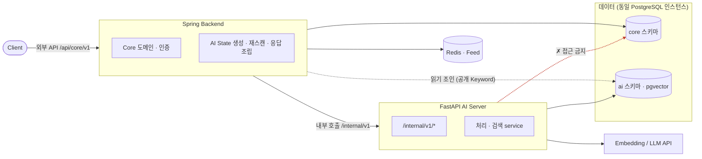
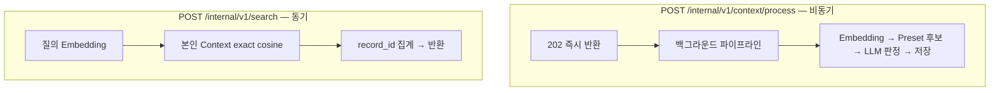
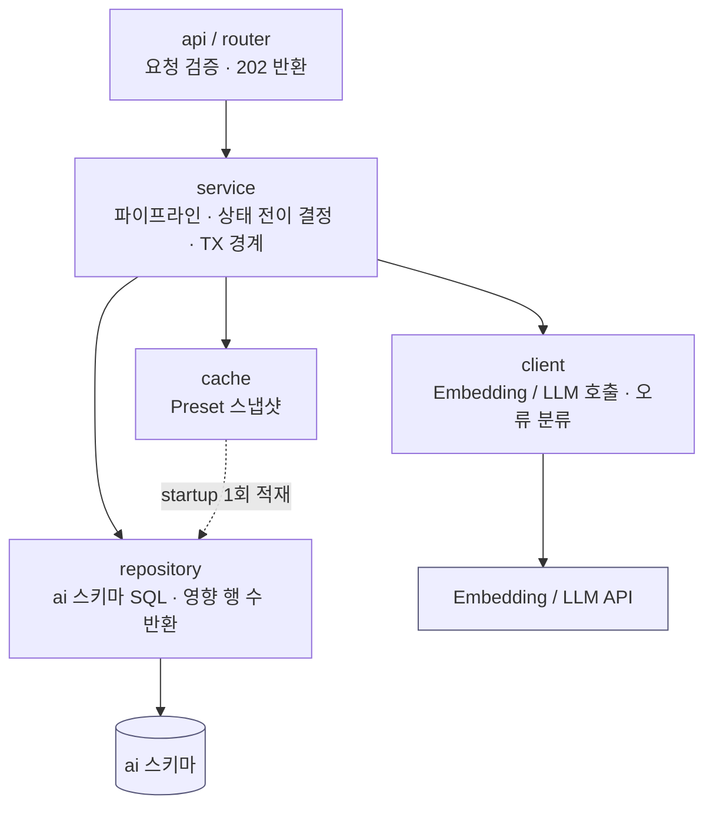
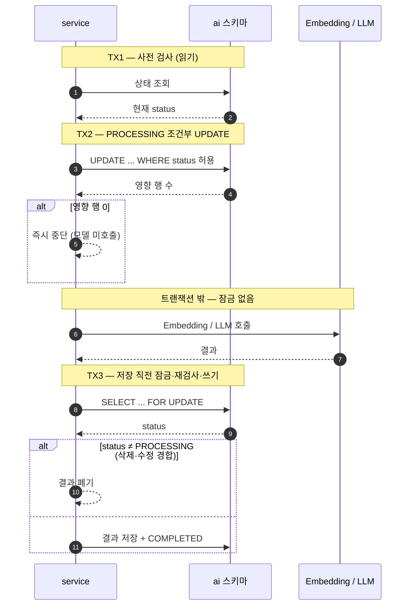

> 현재 코드가 없는 구현 예정 명세입니다.
> 공용 계약은 Team-PinLog/docs의 `static/05_AI_설계.md`를 따릅니다.

# Architecture

근거 계약: `static/05_AI_설계.md` §3.2 FastAPI 책임, §3.3 접근 금지 경계, §12.6 Migration 소유권, §13.3 API 보안과 접근 범위

## 1. 설계 기준

FastAPI 서버는 다음 세 가지 경계 위에서 설계합니다.

1. **스키마 경계** — `ai` 스키마만 사용합니다. `core.*`는 조회도 하지 않습니다.
2. **책임 경계** — 인증 판단, Core 상태 변경, Feed 계산을 하지 않습니다.
3. **소유권 경계** — 스키마 요구사항과 Query는 이 레포가 정의하지만, Migration 실행 주체는 back입니다.

이 경계 때문에 FastAPI에는 "도메인 트랜잭션"이 없습니다. 있는 것은 외부 모델 호출과
`ai` 스키마에 대한 짧은 정합성 트랜잭션뿐이며, 계층 구조도 이 특성에 맞춥니다.

## 2. 시스템 맥락

FastAPI 서버가 전체 AI 시스템에서 차지하는 위치와 경계입니다. 공용 시스템도는 `static/05_AI_설계.md` §3에 있고, 여기서는 FastAPI 관점으로 봅니다.



- Client는 FastAPI를 직접 호출하지 않습니다. 모든 외부 요청은 Spring을 거칩니다.
- FastAPI는 `ai` 스키마와 외부 모델 API만 접근합니다. `core.*`는 조회도 하지 않습니다(빨간 경계).
- Spring은 응답 조립을 위해 `ai` 스키마를 **읽기 조인**하지만, 반대 방향(FastAPI→core)은 없습니다.

두 개의 진입 경로가 있고 처리 방식이 다릅니다.



## 3. 모듈 구조

```text
app/
├── main.py                     # FastAPI 인스턴스, lifespan, 라우터 등록
├── api/
│   └── internal/v1/
│       ├── context.py          # POST /internal/v1/context/process
│       └── search.py           # POST /internal/v1/search
├── schema/                     # 요청·응답 Pydantic 모델 (내부 API 계약 표현)
│   ├── context.py
│   ├── search.py
│   └── llm.py                  # LLM 구조화 출력 스키마
├── service/
│   ├── context_processing.py   # 처리 파이프라인 오케스트레이션
│   ├── embedding_service.py    # Embedding 생성·재사용 판단
│   ├── keyword_service.py      # 후보 검색 + LLM 판정
│   └── search_service.py       # 개인 검색
├── repository/
│   ├── ai_state_repo.py        # ai.context_ai_state
│   ├── context_embedding_repo.py
│   ├── context_keyword_repo.py # ai.context_keyword, ai.context_keyword_analysis
│   └── keyword_preset_repo.py  # ai.keyword_preset
├── cache/
│   └── preset_cache.py         # Keyword Preset 메모리 Cache
├── client/
│   ├── embedding_client.py     # Embedding API
│   └── llm_client.py           # LLM API
└── core/
    ├── config.py               # 단일 설정 진입점 (Embedding Profile 포함)
    ├── db.py                   # 엔진, 세션 팩토리, search_path
    ├── errors.py               # 오류 분류 타입
    └── logging.py
```

계층 간 호출은 **한 방향**입니다. 화살표 방향으로만 의존하며, 역방향 의존이나 계층 건너뛰기를 두지 않습니다.



- `service`만 여러 계층을 오케스트레이션합니다. `repository`·`client`·`cache`는 서로를 직접 부르지 않습니다.
- `repository`는 상태 전이를 판단하지 않고 **영향 행 수만 반환**합니다. 중단 여부는 `service`가 정합니다.
- `client`는 DB를, `repository`는 외부 API를 모릅니다. 두 축이 만나는 지점은 오직 `service`입니다.

## 4. 계층 규칙

| 계층 | 하는 일 | 하지 않는 일 |
|---|---|---|
| `api` (router) | 요청 검증, 서비스 호출, 상태코드 결정 | SQL 작성, 외부 모델 호출, 상태 전이 판단 |
| `service` | 파이프라인 순서, 상태 전이 결정, 트랜잭션 경계 지정 | SQL 문자열 직접 작성, HTTP 세부 처리 |
| `repository` | `ai` 스키마 SQL 실행, 영향 행 수 반환 | 상태 전이 여부 판단, 재시도 정책 |
| `client` | 외부 API 호출, 타임아웃, 오류 분류 | DB 접근, 상태 전이 |
| `cache` | Preset 스냅샷 보관 | DB 쓰기 |

핵심 규칙:

- **조건부 UPDATE의 "영향 행 수"는 repository가 그대로 반환하고, 중단 여부는 service가 판단합니다.**
  repository가 예외를 던져 흐름을 결정하지 않습니다. 상세는 [state-machine.md](state-machine.md).
- router는 상태를 모릅니다. `POST /internal/v1/context/process`는 요청 형식만 검증한 뒤
  `202 Accepted`를 반환하고, 실제 처리는 service가 백그라운드에서 수행합니다.
- client는 DB를 모릅니다. 외부 호출 실패는 분류된 오류로 service까지 올라오고,
  상태 반영 여부는 service가 결정합니다. 분류 기준은 [failure-recovery.md](failure-recovery.md).

## 5. Preset Cache 위치

Keyword Preset은 25~30개 규모의 준정적 데이터이고 Preset 변경은 배포 작업으로 처리하므로,
요청마다 DB에서 읽지 않고 **프로세스 메모리 Cache**에 둡니다.

- 위치: `app/cache/preset_cache.py`. `service`가 소유하고 `keyword_service`만 소비합니다.
- 적재 시점: `main.py`의 lifespan startup에서 `keyword_preset_repo`를 통해 1회 적재.
- 적재 범위: `active = true`이고 현재 Embedding Profile과 일치하는 행.
- 보관 내용: `id`, `code`, `display_name`, `category`, `description`, `examples`,
  `visibility`, `version`, `embedding`.
- 무효화: TTL 기반 재적재(기본 주기 설정값) + 프로세스 재시작. Preset 변경이 배포로만
  이루어지므로 별도 무효화 API를 두지 않습니다.
- 다중 워커: 워커별로 독립 Cache를 가집니다. Preset은 읽기 전용이므로 워커 간 동기화가 필요 없습니다.

Cache는 **후보 판정에 필요한 메타데이터 제공**이 목적입니다. 후보 TOP-K 벡터 검색을
메모리에서 할지 DB에서 할지는 [keyword-preset.md](keyword-preset.md)에서 정의합니다.

## 6. DB 세션 경계

### 6.1 원칙

FastAPI의 트랜잭션은 **짧고 여러 개**입니다. 외부 모델 호출을 트랜잭션 안에 넣지 않습니다.

```text
[TX1] 사전 검사 조회                    (읽기, 즉시 커밋)
[TX2] PROCESSING 조건부 UPDATE           (쓰기, 즉시 커밋)
      ── 트랜잭션 밖 ── Embedding API 호출
      ── 트랜잭션 밖 ── LLM API 호출
[TX3] FOR UPDATE 재검사 + 결과 저장 + COMPLETED 전이 (하나의 트랜잭션)
```



모델 호출은 수 초가 걸리므로 그 구간에 행 잠금을 잡고 있으면 Spring의 삭제·수정 트랜잭션과
재스캔이 함께 막힙니다. 따라서 잠금은 저장 직전 TX3에서만 잡고, 그 안에서는 SQL만 수행합니다.

TX1이 통과했더라도 TX3에서 다시 검사해야 하는 이유는 [deletion-race-control.md](deletion-race-control.md)를 참조합니다.

### 6.2 구현 규칙

- 세션 팩토리는 `app/core/db.py`가 소유하고, service가 `async with session_scope()` 형태로
  필요한 구간에만 엽니다. 요청 전체를 하나의 세션으로 감싸지 않습니다.
- 요청 단위 DI 세션(`Depends(get_session)`)은 **검색 API에만** 사용합니다. 검색은 읽기 전용
  단일 Query이므로 하나의 세션으로 충분합니다.
- 처리 파이프라인은 백그라운드에서 실행되므로 요청 스코프 세션을 사용할 수 없습니다.
  서비스가 자신의 세션을 직접 열고 닫습니다.
- TX3은 `SELECT ... FOR UPDATE` → 검증 → 쓰기 → 커밋을 **한 세션에서** 수행합니다.
  중간에 어떤 네트워크 호출도 넣지 않습니다.
- Embedding 단계 TX3과 Keyword 단계 TX3은 분리합니다. 두 status가 독립 전이하므로
  Embedding COMPLETED가 Keyword 실패로 롤백되면 안 됩니다.

### 6.3 접속 권한과 스키마

- DB 롤은 `ai` 스키마에 대한 권한만 가집니다. `core.*` 권한을 부여하지 않습니다.
- 커넥션의 `search_path`를 `ai`로 고정하여 실수로 다른 스키마를 참조하지 못하게 합니다.
- 애플리케이션 기동 시 DDL을 실행하지 않습니다. 테이블이 없으면 기동 실패로 처리하고,
  스키마 생성은 back의 migration을 기다립니다.
- `ai.context_embedding.is_deleted`는 읽기만 합니다. FastAPI의 UPSERT는 이 컬럼을
  갱신 대상에 포함하지 않습니다.

## 7. 사용하는 테이블

| 테이블 | FastAPI 접근 |
|---|---|
| `ai.keyword_preset` | 읽기 |
| `ai.context_ai_state` | 읽기 / 조건부 UPDATE (status, updated_at) |
| `ai.context_embedding` | 읽기 / UPSERT (`is_deleted` 제외) |
| `ai.context_keyword` | 읽기 / DELETE + INSERT |
| `ai.context_keyword_analysis` | UPSERT |
| `core.*` | 접근하지 않음 |

`retry_count`는 Spring이 관리합니다. FastAPI는 이 컬럼을 증가시키지 않습니다.

## 8. 노출 경계

- `/internal/v1/*` 만 노출하며 내부 네트워크에서만 접근 가능합니다.
- 서비스 간 인증(공유 시크릿 헤더 등)을 미들웨어에서 검증합니다. User 인증은 판단하지 않습니다.
- `userId`는 요청 본문으로 전달받아 **필터로만** 사용합니다. 소유권 판단은 Spring이 합니다.
