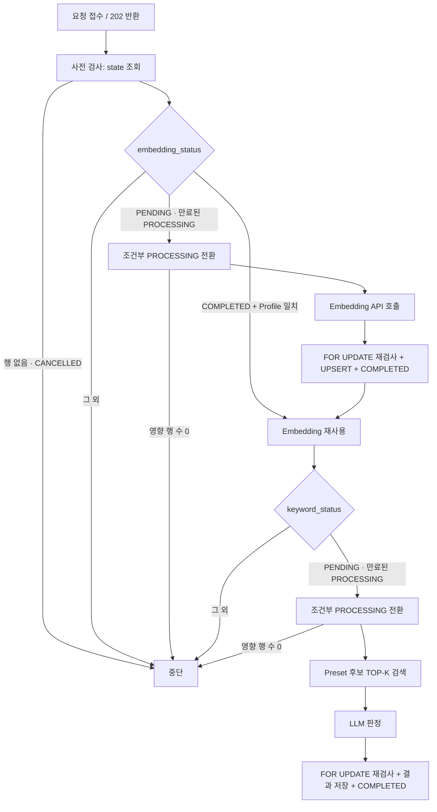

> 현재 코드가 없는 구현 예정 명세입니다.
> 공용 계약은 Team-PinLog/docs의 `static/05_AI_설계.md`를 따릅니다.

# Context Processing Pipeline

근거 계약: `static/05_AI_설계.md` §4.2 Context 불변성, §5 비동기 AI 처리, §6.6 결과 저장 불변식, §13.1 Context 처리

## 1. 엔드포인트

```text
POST /internal/v1/context/process
```

요청값: `contextId`, `userId`, `recordId`, `text`, `placeMeta`
응답: `202 Accepted`

`202`는 **접수**만 의미합니다. 완료 통보용 웹훅이나 폴링 계약을 두지 않으며,
Spring은 `ai.context_ai_state`를 직접 조회하여 상태를 파악합니다.

router가 하는 일은 요청 스키마 검증과 백그라운드 작업 등록뿐입니다. 상태 검사·모델 호출·저장은
전부 등록된 작업 안에서 실행되므로, 상태 검사에서 중단되더라도 응답은 이미 `202`입니다.
이는 오류가 아니라 설계된 동작입니다.

## 2. 처리 단위

AI 처리 단위는 Record가 아니라 **Context**입니다. 하나의 요청은 하나의 Context를 처리하며,
같은 Record의 다른 Context에 영향을 주지 않습니다.

파이프라인은 독립적인 두 단계로 구성됩니다.

| 단계 | 상태 컬럼 | 산출물 |
|---|---|---|
| Embedding | `embedding_status` | `ai.context_embedding` |
| Keyword | `keyword_status` | `ai.context_keyword`, `ai.context_keyword_analysis` |

두 단계는 순서상 Embedding → Keyword이지만 **상태는 독립**입니다.
Embedding이 이미 COMPLETED이면 그 단계를 건너뛰고 Keyword부터 재개합니다
([partial-resume.md](partial-resume.md)).

### 2.1 context_id는 본문의 정체성이다

Context는 불변 엔티티입니다(계약 §4.2).

```text
동일한 context_id는 항상 동일한 Context 본문을 의미한다.
```

- 파이프라인은 `context_id`로 찾은 State가 요청의 `text`에 대한 State라고 가정할 수 있습니다.
  본문 버전을 대조하는 단계가 없습니다.
- 같은 `context_id`에 다른 `text`가 오는 것은 **계약 위반**입니다(계약 §13.1).
  FastAPI는 이를 정상적인 Context 수정으로 처리하지 않고, 상태 기계의 통상 경로대로만
  진행한 뒤 `WARN` 이상으로 로그를 남깁니다.
- Context 수정은 반드시 **새 `context_id`로 도착**합니다. 구 Context는 Spring이
  소프트 삭제하고 두 status를 `CANCELLED`로 바꾸므로, 구 `context_id` 요청은
  §4.2에서 시작조차 하지 않습니다([deletion-race-control.md](deletion-race-control.md)).

## 3. 전체 흐름



## 4. 단계별 구현

### 4.1 사전 검사

모델 호출 전에 한 번, 잠금 없이 조회합니다. 목적은 **불필요한 API 비용 차단**이며
정합성 보장이 아닙니다.

```sql
SELECT embedding_status, keyword_status
FROM ai.context_ai_state
WHERE context_id = :context_id;
```

중단 조건:

- 행이 없음 — Spring이 아직 State를 커밋하지 않았거나 이미 정리됨. 저장하지 않고 종료.
- 두 status가 모두 CANCELLED — 삭제되었거나 수정으로 대체된 구 Context. 종료
  (검증 시나리오 6).
- 두 status가 모두 진행 불가(COMPLETED/FAILED/CANCELLED 조합) — 할 일 없음. 종료.

사전 검사에서 통과했다는 사실은 **아무것도 보장하지 않습니다.** 통과 직후에 Spring이
Context를 삭제할 수 있으므로, 저장 직전 잠금 검사를 반드시 다시 수행합니다
([deletion-race-control.md](deletion-race-control.md)).

### 4.2 조건부 PROCESSING 전환

단계별로 각각 수행합니다. `PENDING`이거나 **만료된 stale `PROCESSING`**일 때만 전이하며,
영향 행 수가 0이면 그 단계를 시작하지 않습니다(계약 §6.5).

```sql
UPDATE ai.context_ai_state
SET embedding_status = 'PROCESSING',
    updated_at = now()
WHERE context_id = :context_id
  AND embedding_status IN ('PENDING', 'PROCESSING')
  AND (embedding_status = 'PENDING'
       OR updated_at < now() - :processing_expiry);
```

Keyword 단계는 `embedding_status = 'COMPLETED'` 조건을 추가하고 대상 컬럼을 바꿉니다.

영향 행 수 0이 의미하는 것:

- 다른 워커가 방금 PROCESSING으로 전환함 → 중복 실행 방지 (계약 §13.1의 멱등성 근거)
- 상태가 CANCELLED로 바뀜 → 삭제되었거나 수정으로 대체된 구 Context
- 상태가 COMPLETED/FAILED로 바뀜 → 처리 대상 아님

`PROCESSING` 재선점을 만료된 작업으로 한정하는 이유는
[state-machine.md](state-machine.md) §3.1을 참조합니다.

어느 경우든 **그 단계를 시작하지 않습니다.** 예외를 던지지 않고 정상 종료로 취급합니다.
전이 규칙 전체는 [state-machine.md](state-machine.md)를 참조합니다.

### 4.3 Embedding 호출

- 입력은 Context 본문 `text`입니다. `placeMeta`를 본문에 결합할지는 프롬프트/입력 구성 규칙에
  따르며, 결합 여부가 바뀌면 Embedding Profile을 바꿔 재생성 대상으로 만듭니다
  ([model-profile.md](model-profile.md)).
- 트랜잭션 밖에서 호출합니다. 잠금을 잡은 채 외부 API를 기다리지 않습니다.
- 클라이언트 타임아웃과 오류 분류는 [failure-recovery.md](failure-recovery.md)를 따릅니다.
- 반환 벡터의 차원이 설정된 Dimension과 다르면 저장하지 않고 영구 오류로 처리합니다.

### 4.4 Embedding 저장

하나의 트랜잭션에서 다음 순서로 수행합니다.

```text
1. SELECT ... FOR UPDATE ai.context_ai_state
2. embedding_status == 'PROCESSING' 확인
3. UPSERT ai.context_embedding
4. UPDATE embedding_status = 'COMPLETED'
5. COMMIT
```

2가 실패하면 **결과를 폐기**하고 아무것도 쓰지 않은 채 롤백합니다.
계약 §6.6의 저장 불변식이 이 지점에서 강제됩니다.

Embedding Row가 아직 없는 상태에서 Context가 삭제·수정되면 Spring의 `is_deleted` UPDATE는
영향 행 수 0으로 끝납니다. 이때 늦게 도착하는 INSERT를 막는 것은 2의 status 검사뿐이므로,
이 검사를 "행이 이미 있는지"로 대체할 수 없습니다(계약 §11.2, 검증 시나리오 12).

UPSERT 시 주의:

- `embedding_profile`을 함께 기록합니다. 이 값이 이후 재사용·검색 가능 여부의 판단 기준입니다.
- `user_id`, `record_id`는 요청값으로 채웁니다. 검색 시 필터·집계에 쓰이는 비정규화 값입니다.
- **`is_deleted`를 갱신 대상에 넣지 않습니다.** `ON CONFLICT DO UPDATE`의 SET 절에
  `is_deleted`가 들어가면 삭제된 Context의 Embedding이 되살아납니다. Spring만 이 컬럼을 바꿉니다.

### 4.5 Preset 후보 TOP-K 검색

저장된(또는 재사용한) Context Embedding을 질의 벡터로 사용해 `ai.keyword_preset`에서
상위 K개 후보를 뽑습니다. 프리셋 전체를 LLM에 넘기지 않는 이유와 K 결정, 필터 조건은
[keyword-preset.md](keyword-preset.md)에서 정의합니다.

Context Embedding과 Preset Embedding의 Profile이 다르면 비교가 성립하지 않으므로
**판정을 중단**합니다(계약 §7.3, 검증 시나리오 13).

### 4.6 LLM 판정

- LLM은 후보 목록 안에서만 선택합니다. 자유 생성하지 않습니다.
- 구조화 출력으로 `keyword_id` 배열과 `confidence`, `unmatchedConcepts`를 받습니다.
- 후보 목록에 없는 값이 반환되면 매핑 단계에서 폐기합니다.
- 선택 결과가 0개인 것은 오류가 아니라 **정상 완료**입니다.

### 4.7 Keyword 저장

Embedding 저장과 동일한 구조의 트랜잭션입니다.

```text
1. SELECT ... FOR UPDATE ai.context_ai_state
2. embedding_status == 'COMPLETED' AND keyword_status == 'PROCESSING' 확인
3. DELETE FROM ai.context_keyword WHERE context_id = :context_id
4. INSERT INTO ai.context_keyword (...)         -- 0건일 수 있음
5. UPSERT ai.context_keyword_analysis           -- unmatchedConcepts
6. UPDATE keyword_status = 'COMPLETED'
7. COMMIT
```

- Keyword 저장 조건은 두 status를 함께 봅니다. Embedding이 완료되지 않은 Context의
  Keyword 결과는 저장하지 않습니다(계약 §6.6).
- 3~4의 delete-insert로 이전 재시도에서 남은 Keyword가 섞이지 않게 합니다.
  `ai.context_keyword`의 Primary Key는 `context_id + keyword_id`이므로,
  같은 Context를 다시 판정하면 결과 집합 전체를 교체합니다.
- 4가 0건이어도 6은 COMPLETED입니다. "Keyword 없음"과 "미처리"를 상태로 구분합니다.
- Embedding 저장 트랜잭션과 분리합니다. Keyword 저장이 실패해도 이미 COMPLETED인
  Embedding은 유지되어야 합니다.

## 5. 중복 요청

같은 Context에 대한 동시 요청은 §4.2의 조건부 UPDATE에서 흡수됩니다.
먼저 도달한 요청만 PENDING → PROCESSING 전이에 성공하고, 나머지는 영향 행 수 0으로
시작조차 하지 않습니다. 뒤이은 요청이 보는 `PROCESSING`은 아직 만료되지 않았으므로
재선점 조건에도 걸리지 않습니다. 별도의 분산 락이나 큐를 두지 않습니다(계약 §5.1, §13.1).

같은 `context_id`로 온 요청은 정의상 같은 본문에 대한 요청이므로, 어느 쪽이 이겨도
결과가 같습니다. 이것이 중복 요청을 상태 검사만으로 흡수할 수 있는 근거입니다.

## 6. FastAPI가 하지 않는 것

- `retry_count` 증가 — Spring 재스캔의 책임입니다.
- `PENDING`이나 `CANCELLED`로의 전이 — Spring만 수행합니다.
- 재시도 소진 Finalizer의 `FAILED` — Spring만 수행합니다(계약 §6.4, §10.4).
- `is_deleted` 변경 — Spring만 수행합니다.
- `core.*` 조회 — Context 본문은 요청 본문으로만 받습니다. 재시도 시 해당 Context가 아직
  삭제되지 않았는지 확인하고 요청을 다시 보내는 것도 Spring의 책임입니다(계약 §10.3).
  Context가 불변이므로 재요청의 `text`는 최초 요청과 동일합니다.
- Context 수정 처리 — 수정은 Spring의 Core 트랜잭션에서 구 Context 삭제와 신 Context 생성으로
  이루어집니다. FastAPI는 그 결과로 도착한 **새 `context_id` 요청**만 봅니다(계약 §5.3).
