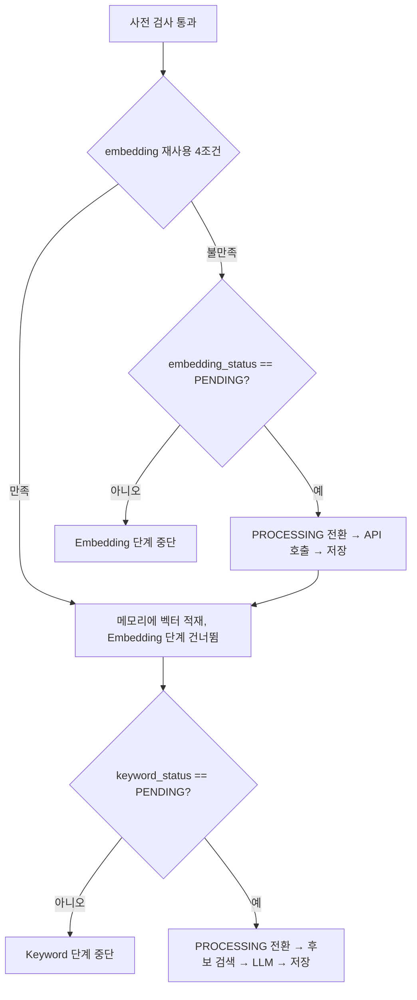

> 현재 코드가 없는 구현 예정 명세입니다.
> 공용 계약은 Team-PinLog/docs의 `static/05_AI_설계.md`를 따릅니다.

# 부분 재개

근거 계약: `static/05_AI_설계.md` §6.2 상태 컬럼, §7.4 부분 재사용, §10.2 부분 실패

## 1. 재개가 성립하는 이유

`ai.context_ai_state`가 두 개의 독립 status를 가지므로 다음 상태가 정상적으로 존재합니다.

```text
embedding_status = COMPLETED
keyword_status   = PENDING
```

Embedding은 성공했고 LLM 판정만 실패한 경우입니다. Spring 재스캔이 이 Context를 다시
FastAPI로 보낼 때, **Embedding API를 다시 호출하지 않고 Keyword 단계부터 재개**합니다.

Embedding 호출은 이 파이프라인에서 가장 비싼 외부 호출 중 하나이고, 같은 본문에 대해
같은 벡터를 다시 만드는 일이므로 재호출은 순수한 낭비입니다.

## 2. 재사용 판정

Embedding 재사용은 **네 조건을 모두** 만족할 때만 허용합니다.

```text
1. state.context_version      == request.contextVersion
2. state.embedding_status     == 'COMPLETED'
3. embedding.context_version  == request.contextVersion
4. embedding.embedding_profile == 현재 Embedding Profile
```

조회는 한 번의 Query로 수행합니다.

```sql
SELECT e.embedding,
       e.context_version   AS emb_version,
       e.embedding_profile AS emb_profile,
       s.context_version   AS state_version,
       s.embedding_status,
       s.keyword_status
FROM ai.context_ai_state s
LEFT JOIN ai.context_embedding e ON e.context_id = s.context_id
WHERE s.context_id = :context_id;
```

조건별 의미:

| 조건 | 없으면 생기는 일 |
|---|---|
| 1 | 이미 수정된 Context에 대해 구버전 작업을 재개 |
| 2 | 저장 중 중단되어 불완전할 수 있는 행을 재사용 |
| 3 | State는 최신인데 Embedding 행이 구버전인 중간 상태를 재사용 |
| 4 | 차원·거리 기준이 다른 벡터를 Preset과 비교 |

3이 2와 별개로 필요한 이유: State와 Embedding은 같은 트랜잭션에서 갱신되지만,
Spring이 Context 수정으로 State의 `context_version`을 올리고 status를 PENDING으로
초기화하는 시점에 Embedding 행은 그대로 남아 있습니다. 이때 `state.embedding_status`는
PENDING이므로 2에서 걸리지만, 조건 3은 그와 무관하게 **행 자체가 어느 버전의 산출물인지**를
확인하는 값이므로 재사용 경로에서 반드시 검사합니다.

4가 실패하면 재사용이 아니라 **재생성** 대상입니다. Profile 불일치 시의 동작은
[model-profile.md](model-profile.md)를 따릅니다.

`is_deleted`는 재사용 판정에 사용하지 않습니다. 삭제된 Context는 status가 CANCELLED이므로
조건 2에서 이미 걸러지며, `is_deleted`는 검색 단계의 보조 방어선입니다.

## 3. 재개 분기

요청 하나를 받았을 때 단계별로 독립 판단합니다.



구현상의 결론:

- Embedding 단계를 건너뛰었다고 해서 Keyword 단계도 건너뛰지 않습니다.
  두 단계의 진행 여부는 각자의 status가 결정합니다.
- Embedding 단계가 중단되었더라도 Keyword 단계는 시도합니다. `embedding_status`가
  COMPLETED여서 중단된 경우가 정확히 재개 경로입니다.
- Keyword 단계에 필요한 벡터는 재사용 판정에서 이미 읽어 둔 값을 씁니다.
  후보 검색을 위해 Embedding을 다시 조회하지 않습니다.

## 4. 재개할 수 없는 조합

| `embedding_status` | `keyword_status` | 동작 |
|---|---|---|
| COMPLETED | PENDING | **재개.** 벡터 재사용, Keyword만 수행 |
| PENDING | PENDING | 전체 수행 |
| COMPLETED | FAILED | 아무것도 하지 않음. FAILED는 재스캔 대상이 아니며 PROCESSING으로 직접 전이 불가 |
| FAILED | PENDING | Keyword만 시도. 다만 재사용 4조건을 만족하는 Embedding이 없으므로 벡터가 없어 판정 불가 → Keyword 단계도 시작하지 않음 |
| COMPLETED | COMPLETED | 할 일 없음 |
| CANCELLED | CANCELLED | 처리·저장 대상 아님 |

`FAILED / PENDING` 조합에서 Embedding을 새로 만들어 Keyword를 진행하지 않는 이유는,
그것이 `FAILED → PROCESSING` 전이를 우회하는 것과 같기 때문입니다. FAILED 단계는
Context 본문이 수정되어 Spring이 PENDING으로 초기화할 때만 다시 살아납니다(계약 §10.4).

## 5. Keyword 재저장

재개로 Keyword를 다시 판정하면 기존 `ai.context_keyword` 행이 남아 있을 수 있습니다.
저장은 항상 **해당 Context의 기존 행 삭제 후 삽입**으로 수행합니다
([keyword-preset.md](keyword-preset.md) §5).

Embedding은 반대로 UPSERT입니다. Context당 한 행이며 `is_deleted`를 건드리지 않습니다.

## 6. 검증

검증 시나리오 4(Embedding 성공, Keyword 실패 → Embedding 재호출 없이 Keyword만 재개)가
이 문서의 주 검증 대상입니다. 테스트는 Embedding Client에 대한 호출 횟수를 0으로 단언합니다.
상세는 [integration-tests.md](integration-tests.md).
