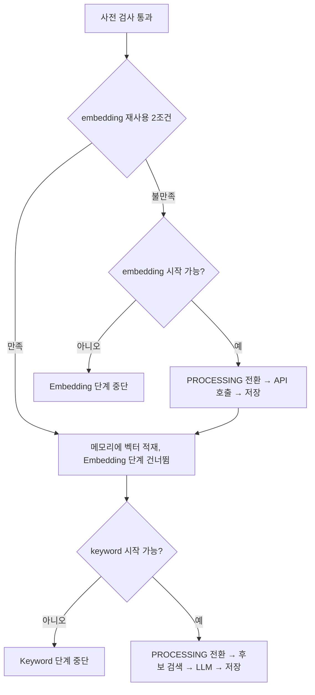

> 구현 반영됨(ai#5·#6, `app/`). 이 문서는 계약 명세이며 구현이 이를 따른다. 리포트: [implements/2026-07-23-fastapi-implementation.md](../implements/2026-07-23-fastapi-implementation.md).
> 공용 계약은 Team-PinLog/docs의 `static/05_AI_설계.md`를 따릅니다.

# 부분 재개

근거 계약: `static/05_AI_설계.md` §6.1 상태 컬럼, §7.4 부분 재사용, §10.2 부분 실패

## 1. 재개가 성립하는 이유

`ai.context_ai_state`가 두 개의 독립 status를 가지므로 다음 상태가 정상적으로 존재합니다.

```text
embedding_status = COMPLETED
keyword_status   = PENDING
```

Embedding은 성공했고 LLM 판정만 실패한 경우입니다. Spring 재스캔이 이 Context를 다시
FastAPI로 보낼 때, **Embedding API를 다시 호출하지 않고 Keyword 단계부터 재개**합니다.

Embedding 호출은 이 파이프라인에서 가장 비싼 외부 호출 중 하나이고, 같은 본문에 대해
같은 벡터를 다시 만드는 일이므로 재호출은 순수한 낭비입니다.

## 2. 재사용 판정

Embedding 재사용은 **두 조건을 모두** 만족할 때만 허용합니다.

```text
1. state.embedding_status      == 'COMPLETED'  (그리고 Embedding 행이 존재)
2. embedding.embedding_profile == 현재 Embedding Profile
```

조회는 한 번의 Query로 수행합니다.

```sql
SELECT e.embedding,
       e.embedding_profile AS emb_profile,
       s.embedding_status,
       s.keyword_status
FROM ai.context_ai_state s
LEFT JOIN ai.context_embedding e ON e.context_id = s.context_id
WHERE s.context_id = :context_id;
```

조건별 의미:

| 조건 | 없으면 생기는 일 |
|---|---|
| 1 | 저장 중 중단되어 불완전하거나 아직 없는 행을 재사용 |
| 2 | 차원·거리 기준이 다른 벡터를 Preset과 비교 |

Context 본문 일치를 확인하는 조건은 없습니다. Context가 불변이므로
**같은 `context_id`의 Embedding은 정의상 같은 본문의 산출물**입니다(계약 §4.2).
State와 Embedding 행 사이에 버전이 어긋나는 중간 상태 자체가 존재하지 않습니다.

**수정된 Context는 새 `context_id`이므로 구 Context의 Embedding을 재사용하지 않습니다.**
재사용 판정은 `context_id` 단위 조회이고 신 Context에는 아직 Embedding 행이 없으므로,
조건 1에서 자연히 걸러집니다. 구 Context의 Embedding을 신 Context로 승계하는 경로를
별도로 만들지 않습니다(계약 §4.2 승계 금지).

2가 실패하면 재사용이 아니라 **재생성** 대상입니다. Profile 불일치 시의 동작은
[model-profile.md](model-profile.md)를 따릅니다.

`is_deleted`는 재사용 판정에 사용하지 않습니다. 삭제·수정된 Context는 status가 CANCELLED이므로
조건 1에서 이미 걸러지며, `is_deleted`는 검색 단계의 보조 방어선입니다.

## 3. 재개 분기

요청 하나를 받았을 때 단계별로 독립 판단합니다.



"시작 가능"의 판정은 조건부 UPDATE 한 번이며, 그 허용 집합은
`PENDING` 또는 **만료된 stale `PROCESSING`**입니다([state-machine.md](state-machine.md) §3.1).

구현상의 결론:

- Embedding 단계를 건너뛰었다고 해서 Keyword 단계도 건너뛰지 않습니다.
  두 단계의 진행 여부는 각자의 status가 결정합니다.
- Embedding 단계가 중단되었더라도 Keyword 단계는 시도합니다. `embedding_status`가
  COMPLETED여서 중단된 경우가 정확히 재개 경로입니다.
- Keyword 단계에 필요한 벡터는 재사용 판정에서 이미 읽어 둔 값을 씁니다.
  후보 검색을 위해 Embedding을 다시 조회하지 않습니다.

## 4. 재개할 수 없는 조합

| `embedding_status` | `keyword_status` | 동작 |
|---|---|---|
| COMPLETED | PENDING | **재개.** 벡터 재사용, Keyword만 수행 |
| PENDING | PENDING | 전체 수행 |
| COMPLETED | FAILED | 아무것도 하지 않음. FAILED는 재스캔 대상이 아니며 PROCESSING으로 직접 전이 불가 |
| FAILED | PENDING | Keyword만 시도. 다만 재사용 2조건을 만족하는 Embedding이 없으므로 벡터가 없어 판정 불가 → Keyword 단계도 시작하지 않음 |
| COMPLETED | COMPLETED | 할 일 없음 |
| COMPLETED | PROCESSING (만료) | **재개.** 벡터 재사용, stale Keyword 작업 재선점 |
| CANCELLED | CANCELLED | 처리·저장 대상 아님. 삭제되었거나 수정으로 대체된 구 Context |

`FAILED / PENDING` 조합에서 Embedding을 새로 만들어 Keyword를 진행하지 않는 이유는,
그것이 `FAILED → PROCESSING` 전이를 우회하는 것과 같기 때문입니다.
`FAILED`는 진짜 종결 상태이며, 같은 `context_id`를 다시 처리하는 경로는 존재하지 않습니다
(계약 §6.3). 사용자가 본문을 고치면 그것은 **새 `context_id`의 새 State**로 처리되며,
그 처리는 이 Context의 재개가 아닙니다.

Keyword 저장 조건이 `embedding_status = COMPLETED`를 함께 요구하므로(계약 §6.6),
`FAILED / PENDING` 조합은 설령 시작되더라도 저장 단계에서 다시 걸립니다.

## 5. Keyword 재저장

재개로 Keyword를 다시 판정하면 기존 `ai.context_keyword` 행이 남아 있을 수 있습니다.
저장은 항상 **해당 Context의 기존 행 삭제 후 삽입**으로 수행합니다
([keyword-preset.md](keyword-preset.md) §5).

Embedding은 반대로 UPSERT입니다. Context당 한 행이며 `is_deleted`를 건드리지 않습니다.

## 6. 검증

검증 시나리오 7(Embedding 성공, Keyword 실패 → Embedding 재호출 없이 Keyword만 재개)이
이 문서의 주 검증 대상입니다. 테스트는 Embedding Client에 대한 호출 횟수를 0으로 단언합니다.
상세는 [integration-tests.md](integration-tests.md).
